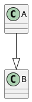

# Chapter 1

**Bold**

*Italic*

***Bold & Italic*** 

- Bullet point

1. ordered list
2. ordered list
3. ordered list

:grin: - No similey

`inline code` 

```ts
console.log("This is typescript")
const a: number = 5
```

```rs
let a = 100
println!("{:?}", a)
````

|My table|Column A| Column B|
|:-|:-|:-|
|Great Table|Wonderful Column| Oh wow|

> My blockquote

[Linko]()


A citiation[^1]

[^1]: Does this work, yeap it does

aaand i forgot ~~strikethrough~~

- [ ] and tasklist
- [x] and tasklist

What is missing? plantuml

lets install it

discovered something

<div class="warning">

This is a bad thing that you should pay attention to.

Warning blocks should be used sparingly in documentation, to avoid "warning
fatigue," where people are trained to ignore them because they usually don't
matter for what they're doing.

</div>


A diagram in UTF-8 text format (inlined automatically)


Force png format:

