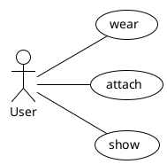
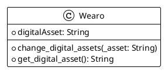
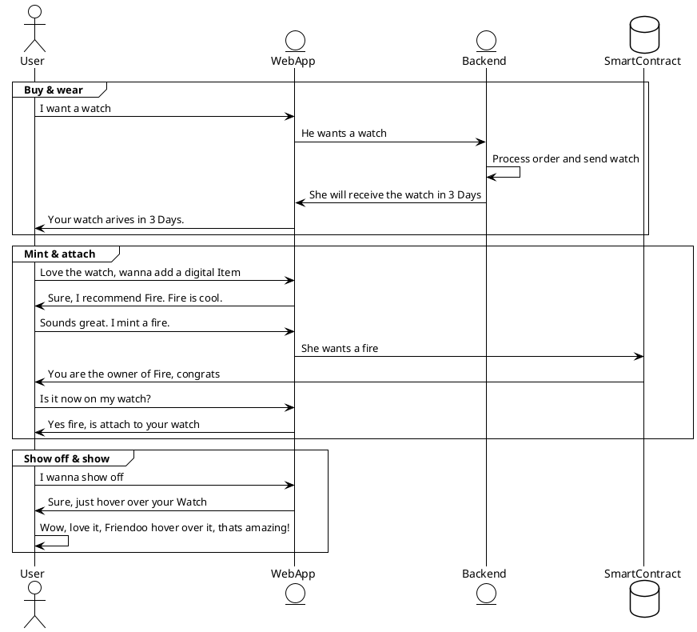

# ✏️ Sketch

The Section `Sketch` deals with shaping an Idea.

The structure is bluntly copied from Software requirement engineering 101. You can use whatever mental model you like. There is no right or wrong.
The goal is to shape the Idea. Every Industry has their unique solution. In art its called concept art. In construction its called draft. In consulting it's called Hubertus Soradium Conventi Modela III, i assume. Nomatter what you choose, the gist of it is, take the Idea and chunk this thing down.

So, Grab your farmer shirt, sharpen your axe. Let's chop this beauty down.

## Idea

> There are many ways to frame an Idea. In business context usually its expected to talk about Problem and Solution. Other ways would be to frame it in what, how and why. Just to give another example.

**Problem**: Digital Assets are not equipable  
**Idea**: Digital Assets on Wearables  
**Solution**: `wearo.xyz`

> That's it. If you are ambitious you can write a businessplan out of it. Or elaborate the Idea in a one pager.

## Requirements

> In Requirements we think roughly about what our product should do. Its a common practice to divide it in functional and nonfunctional requirements

**Functional Requirements**

- The Wearable must be digital equipable
- The Digital Equipment must be ownable
- The Wearable must be a wearable

**Non Functional Requirements**

- The Product should be easy accessible.

## Stories

> In Stories we take our requirement and form Stories out of it. There is mostly a User Stories, but could also include a Smart Contract Story, Frontend Story, Maintainer Story ... . Important is that you break down your bare Requirements in actors and actions. That's kind of the gist of it.

**User Story**

- As a User I want to wear a cool Equipment.
- As a User I want to attach different assets one
- As a User I want to show my assets somehow

> Yeap. That should do the job. I am still not certain where I am going with it. In my backhead is, that I want to gift a wearable to a friend. Currently it seem like that I will go this route. The Ironman watch, which i mentioned previously is kind of a picture that stuck. Overall the theme is move quick, move fast. Sketch with a chalk not with a thiny pencil.

## Diagrams

> Diagrams are the more important section. We quickly think through what is the use, how the data could look like and how the things move of whatever we build. We will use UML for it. That's literally built for it. Sweet.

### Use Case

The Use Case Diagram shows the User does wearing, attaching and showing.  
1 Actor 3 Actions. If you think on Ebay, as an example, User does buy, sell and maybe review. Like always follow [KISS](https://en.wikipedia.org/wiki/KISS_principle)

### Class

The Class Diagram shows, how the digital representation of the Data could look like. I recommend, assume you have no clue and run with the first thing that rushes through your head. The most important part is to spend the minute itself. If you want to see real example, just extend on etherescan. [Wrapped Ether](https://etherscan.io/viewsvg?t=1&a=0xc02aaa39b223fe8d0a0e5c4f27ead9083c756cc2) - [Crypto Kitties](https://etherscan.io/viewsvg?t=1&a=0x06012c8cf97bead5deae237070f9587f8e7a266d).

### Sequence

The Sequence Diagram shows, how things are move. See it as a conversation. Don't try to be perfectionist. The whole point of sketching is to give the Idea a shape, not more and nothing less.

---

Great. Now `wearo.xyz` has a shape. Lets summarize quickly what we wanna do.

I'm Frank. I create `wearo.xyz`. A place to buy watches. Iron Man watches.

Don't overthink, just move on.

Next up paint 🎨
